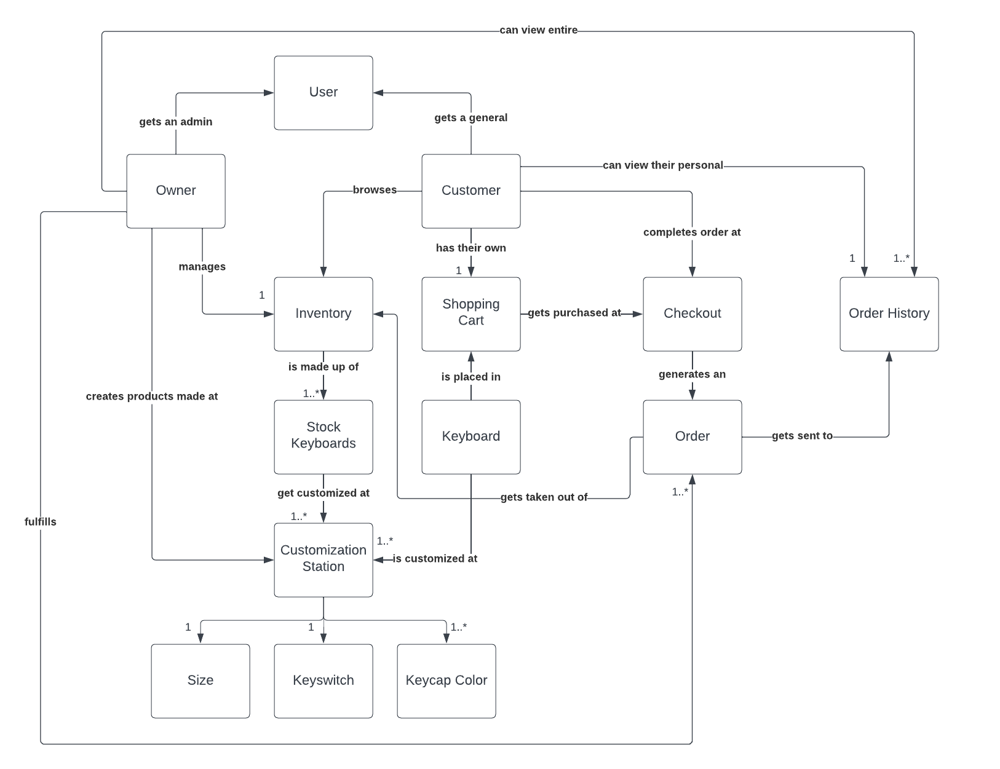
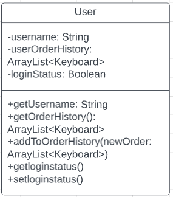
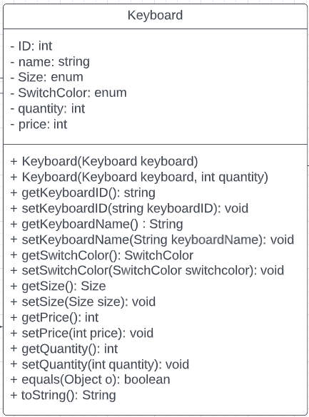

# PROJECT Design Documentation

## Team Information
* Team name: 2B-Keyboard Warriors
* Team members
  * Kyle Berg
  * Andrew Photinakis
  * Andrew Yansick
  * Alec Bhaskaran
  * Justin Ronca

## Executive Summary

Our keyboard webstore is a unique and innovative platform that offers customers the ability to customize their keyboards to their specific needs and preferences.

 With our webstore, customers can select the color of their keycaps, choose their preferred keyswitch type, and even select the size of their keyboard. This customization feature sets us apart from other keyboard retailers, providing customers with a truly personalized experience.

In addition to our customization feature, our webstore also offers an intuitive and user-friendly interface that allows customers to easily navigate and purchase their custom keyboards. We offer a wide range of high-quality keyboards from leading brands in the industry, ensuring that customers have access to the best products available. Customers can even see which keyboards they've purchased in the past by viewing the Order History!

Our webstore also features an inventory management system that allows the administrator to add, remove, and edit the inventory right from the app. This feature ensures that our customers have access to the most up-to-date product offerings and availability.

### Purpose
> Allow customers to browse an inventory of keyboards, customize each keyboard to their needs, and place them in their shopping cart. Allow storeowners to add listing, delete listings, and edit existing listings from the website. 

### Glossary and Acronyms

| Term | Definition |
|------|------------|
| SPA | Single Page |

## Requirements

This section describes the features of the application.

The application has Users and an Admin account.
Users can purchase Keyboards from the Inventory and have a Shopping Cart.
Admin can manage the Inventory.
Keyboards can be customized(Coming Sprint 3)
Shopping Carts are unique to Users(Sprint 3) and hold the Keyboards

### Definition of MVP
The MVP shows the basics of the application, including the Users, Admin, Keyboards, Inventory, and ShoppingCart. 
The frontend is not "customer-ready" but shows simple functionality of the backend.

> _**[Include more for sprint 4]** 

### MVP Features
>  _**[Sprint 4]** Provide a list of top-level Epics and/or Stories of the MVP._

### Enhancements
> _**[Sprint 4]** Describe what enhancements you have implemented for the project._

## Application Domain

This is the domain model of the application.

The Admin manages the Inventory, which holds Keyboards, and the Users have access to the Inventory to add Keyboards to their Shopping Cart.
Keyboards also have customization properties. Orders will be completed in Checkout and all purchases will be stored in Order History, unique to each User.

## Architecture and Design

The architecture of the program is based off the two different account types, Users and Admin. The admin is able to manage
the Inventory and create or delete Keyboards. Users have access to the Inventory and can add Keyboards to their Shopping Cart.
The design allows the website to scale largely as any amount of Users can be created with their own Shopping Cart.

### Summary

The following Tiers/Layers model shows a high-level view of the webapp's architecture.

The e-store web application, is built using the Model–View–ViewModel (MVVM) architecture pattern. 

The Model stores the application data objects including any functionality to provide persistance. 

The View is the client-side SPA built with Angular utilizing HTML, CSS and TypeScript. The ViewModel provides RESTful APIs to the client (View) as well as any logic required to manipulate the data objects from the Model.

Both the ViewModel and Model are built using Java and Spring Framework. Details of the components within these tiers are supplied below.

### Overview of User Interface

This section describes the web interface flow; this is how the user views and interacts
with the e-store application.

> _Provide a summary of the application's user interface.  Describe, from
> the user's perspective, the flow of the pages in the web application._

### View Tier
> _**[Sprint 4]** Provide a summary of the View Tier UI of your architecture.
> Describe the types of components in the tier and describe their
> responsibilities.  This should be a narrative description, i.e. it has
> a flow or "story line" that the reader can follow._

> _**[Sprint 4]** You must  provide at least **2 sequence diagrams** as is relevant to a particular aspects 
> of the design that you are describing.  For example, in e-store you might create a 
> sequence diagram of a customer searching for an item and adding to their cart. 
> As these can span multiple tiers, be sure to include an relevant HTTP requests from the client-side to the server-side 
> to help illustrate the end-to-end flow._

> _**[Sprint 4]** To adequately show your system, you will need to present the **class diagrams** where relevant in your design. Some additional tips:_
 >* _Class diagrams only apply to the **ViewModel** and **Model** Tier_
>* _A single class diagram of the entire system will not be effective. You may start with one, but will be need to break it down into smaller sections to account for requirements of each of the Tier static models below._
 >* _Correct labeling of relationships with proper notation for the relationship type, multiplicities, and navigation information will be important._
 >* _Include other details such as attributes and method signatures that you think are needed to support the level of detail in your discussion._

### ViewModel Tier
> _**[Sprint 4]** Provide a summary of this tier of your architecture. This
> section will follow the same instructions that are given for the View
> Tier above._

> _At appropriate places as part of this narrative provide **one** or more updated and **properly labeled**
> static models (UML class diagrams) with some details such as critical attributes and methods._
> 

### Model Tier

> _**[Sprint 3 & 4]** 

Has the name for the user, order history, and shopping cart. These objects can be accessed and changed through the User,
as each one is specific to the User.

A Keyboard has an ID, name, size, switch color, price, and quantity. The methods allow for the Keyboard to be customized. We used our getters and setters of size, switch color, and quantity for customization.

## OO Design Principles
> _**[Sprint 2, 3 & 4]** 
> 
### CONTROLLER
Our project uses a few controllers:

a. InventoryController: This controller would be responsible for managing products, this includes the
following main functionalities: creating, updating, retrieving, and deleting. Since it will have
access to the entire inventory, it will also be used for searching for a specific product, or products
if necessary, as well as gathering the entire inventory.

b. UserController: This controller will be responsible for managing user logging. A simple
username to login is all that is required. Although a full credential and session management is not
expected, the UserController will know if the admin is logged in, and if so will display a different
page, else the normal page will be displayed.

### OPEN/CLOSED

In building the KeyboardController, it is imperative to use this principle. The KeyboardController is a REST 
API controller class that will interact with the persistence layer and provide an API endpoint for 
keyboard operations. As the time of creation, we have a base controller that is like the 
HeroController we constructed in a previous exercise. While is it basic, it has core functionality 
that should not be tampered with. The plan is to keep the code we have right now as a permanent baseline,
so we have a fallback in the event some extended functionality does not work. This reduces 
possible bugs or breaks occurring in the core functionality.

### SINGLE RESPONSIBILITY

The KeyboardController’s responsibility is to handle requests and provide responses using HTTP protocols. It should not be
concerned with most of the backend, which includes inventory, user account management, and 
general management of Keyboard data. While it is possible to do this, it would be very limiting 
in a variety of ways. For example, there would have to be an inner Keyboard class, limiting code 
reusability. It would reduce modularity, limiting the possibility of expansion like a database, or 
properly testing the product. 

### LOW COUPLING

The principle of low coupling was adhered to by our system’s architecture.  Coupling is an important part of a system, but unnecessary coupling should be eliminated.  Our design eliminates unnecessary coupling in a similar way to the rest basics api.  On our UML diagram, it can be shown that the InventoryFileDAO implements the interface InventoryDAO.  This is how data access objects are implemented so these are coupled.  The InventoryController contains an instance of an InventoryDAO, so these are coupled too out of necessity.  There is no unnecessary coupling present in the design however, as can be seen in our code and our uml diagram below. *see UML diagram*

### More to be included

> _**[Sprint 3 & 4]** OO Design Principles should span across **all tiers.**_

## Static Code Analysis/Future Design Improvements
> _**[Sprint 4]** With the results from the Static Code Analysis exercise, 
> **Identify 3-4** areas within your code that have been flagged by the Static Code 
> Analysis Tool (SonarQube) and provide your analysis and recommendations.  
> Include any relevant screenshot(s) with each area._

> _**[Sprint 4]** Discuss **future** refactoring and other design improvements your team would explore if the team had additional time._

## Testing

The testing performed utilized JUnit tests to isolate certain parts and methods
of the application. Functions were tested for their expected outcomes, and testing 
for correct errors was also completed. The sections below show more in depth
how the testing process was completed.

# TO BE INCLUDED

### Acceptance Testing
> _**[Sprint 2 & 4]** Report on the number of user stories that have passed all their
> acceptance criteria tests, the number that have some acceptance
> criteria tests failing, and the number of user stories that
> have not had any testing yet. Highlight the issues found during
> acceptance testing and if there are any concerns._

### SPRINT 2 USER STORIES

### Unit Testing and Code Coverage
> _**[Sprint 4]** Discuss your unit testing strategy. Report on the code coverage
> achieved from unit testing of the code base. Discuss the team's
> coverage targets, why you selected those values, and how well your
> code coverage met your targets._

### Include jacoco

>_**[Sprint 2 & 4]** **Include images of your code coverage report.** If there are any anomalies, discuss
> those._

